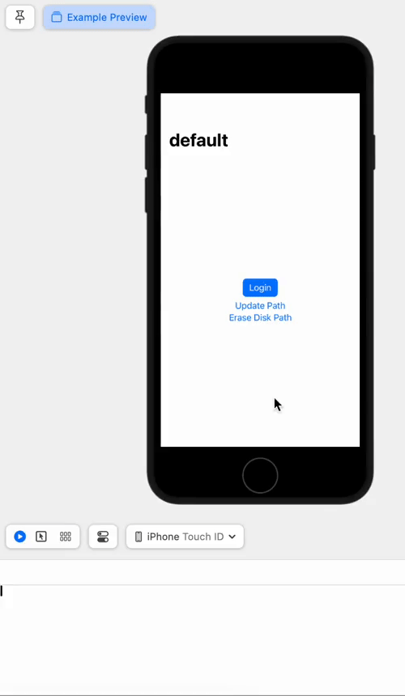

### Contents

Swift package to enable persistence layer over `NavigationPath`. Package also provides a few navigation utils. Package consists of six main things
1. `SerializedNavPath` type, which is an `Observable` that wraps the built-in `NavigationPath`
2. Read-only `pathBinding` property which provides `Binding` to the above `path` property
3. `SerializedNavPath` provides persistence from its initialization stage itself by reading the (saved) serialized data from disk, unless we want to create a new object
    ```Swift
    init(filenameWithExtension: String, createNew: Bool = false)
    ```
4. An internal property `navPathLib` of type `SerializedNavPathLib` is also used, as it contains useful methods listed as following (these methods are only accessible within the package)
    ```Swift
    - func readSerializedData(filenameWithExtension: String? = nil) -> Data?
    - func writeSerializedData(_ data: Data) -> Bool
    - func eraseSerializedData()
    - func log(_ message: String)
    ```
5. Package provides the following routing utils and properties, which are available outside the package
    ```Swift
    // methods
    - func getNavPathForNavigationStack() -> Binding<NavigationPath>
    - func append(_ route: Route)
    - func removeLast()
    // properties
    - var count: Int
    - var routes: [Route]
    ```
6. Package provides the following disk utils, which are available outside the package
    ```Swift
    - func save()
    - func erase()
    ```

### Usage

As seen in the `SerializedNavPathExampleApp`, the `SerializedNavPath` object needs be initialized with the `filenameWithExtension` parameter. The initialization stage itself will load the path data from disk, and set the `path` by de-serializing (or, decoding) this path data. Almost instantly, this `SerializedNavPath` is read by the `NavigationStack`, defined as following. Here, the `getNavPathForNavigationStack` method simply returns the `pathBinding`.
```Swift
NavigationStack(path: navPath.getNavPathForNavigationStack())
```

#### Description

*Internal*
- **readSerializedData**: Mutating method of `SerializedNavPathLib` to read serialized data from file, where filename is obtained using `filenameWithExtension` param, or `_filenameWithExtension` property.
- **writeSerializedData**: Method of `SerializedNavPathLib` for the corresponding write operation, that returns `true` on success.
- **eraseSerializedData**: Another method that removes file using `_filenameWithExtension` property.

*Public*
- **getNavPathForNavigationStack**: This method returns the private property `pathBinding`.
- **append**: This method appends a new element to the `NavigationPath`, and saves the path data to disk.
- **count**: Computed property that represents the number of elements in the `NavigationPath`.
- **removeLast**: If `count` is non-zero, this method removes the last element from the `NavigationPath`.
- **routes**: Computed property obtained by the transformation of `NavigationPath` data to a collection of `Route` type, returns an empty collection if there is no data.
- **save**: Saves `json` encoded `NavigationPath` data to disk using `writeSerializedData` method of `navPathLib`.
- **erase**: Calls `eraseSerializedData` method of `navPathLib`.

#### Debugging

> Debugging can be turned on by setting the `SerializedNavPath.debug` flag. The example app view sets this debug flag in its `init` method. Running the app shows two kinds of logs. The file-io logs show when serialized data is written to the `json` file, or when this file is removed. The other logs are for information only, for e.g. when attempt is made to modify the `pathBinding` property, the log prints *pathBinding is readonly*.

#### Details

In the first example recording, clicking the **Login** button appends "home" `Route` to `NavigationPath`, and calls the save method of `SerializedNavPath`, which in turn calls `navPathLib.writeSerializedData` method, passing it the updated path data. If this step produces error, the log prints *could not save path*, else it prints *data written*, followed by the filename with extension.

### Platforms

- macOS v13 and above
- iOS v16 and above

### Example



First recording shows navigation b/w views, and write logs (for file `MainNavPath.json`). Most importantly, it shows
the `navPath.count` and `navPath.routes` properties in the view. At the end it shows that `pathBinding` is read-only,
and calls `navPath.erase` for demo purposes only. Second recording shows the persistence of navigation path b/w app launches — as a feature of the `SerializedNavPath` package.


#### Details

1. The above recordings are from `SerializedNavPathExampleApp` view.
2. This view initializes a `navPath` of type `SerializedNavPath` using a filename constant.
3. The `title` property retrieves the first route's path from `navPath`, or a default title if no route exists.
4. View `body` is a `NavigationStack` with conditional navigation destinations based on the route path.
5. Each destination (`LoginView`, `HomeView`, `OtherHomeView`) receives and stores the `navPath` for calling the corresponding methods.
